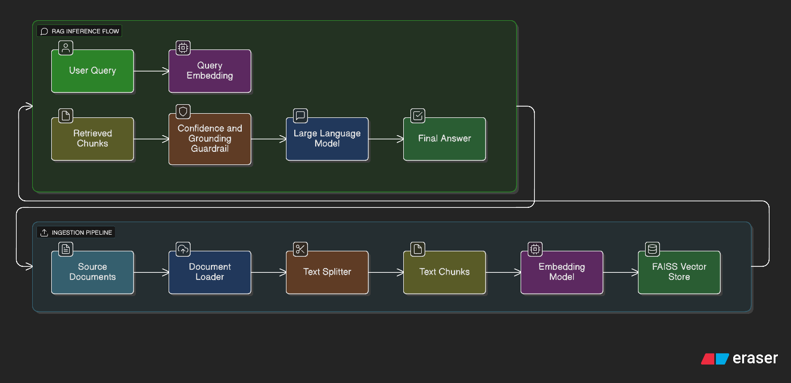

# Mini RAG: Construction Marketplace Assistant

[](https://cbpm3kd7rug3qx3h69kghg.streamlit.app/)

A robust, safety-aware Retrieval-Augmented Generation (RAG) system designed to answer questions based strictly on internal construction documents.

## Architecture

The system follows a standard RAG pipeline with added safety guardrails.



## Workflow

1.  **Ingestion**:
    *   Users upload files via the Streamlit UI.
    *   Files are saved to `data/`.
    *   `src/ingestion.py` loads and splits text into manageable chunks.
    *   `src/embeddings.py` converts chunks into vector embeddings using `sentence-transformers/all-MiniLM-L6-v2`.
    *   `src/vector_store.py` indexes these vectors using FAISS for fast retrieval.

2.  **Retrieval & Generation**:
    *   User asks a question.
    *   System retrieves the top 3 most relevant chunks.
    *   **Safety Check**: If the similarity score is low (distance > 1.0), a "Low Confidence" warning is injected.
    *   **Prompting**: The LLM is prompted with strict instructions to answer *only* from the context.
    *   **Response**: The answer is displayed along with the source chunks for transparency.

## Guardrails & Safety

To prevent hallucinations and ensure professional responses, we implemented the following:

1.  **"Not Explicitly Stated" Fallback**:
    *   If the answer is not in the documents, the model is forced to reply: *"Not specified in this document"*.
2.  **Vocabulary Control**:
    *   **Allowed**: "Positioned as", "Subject to contract".
    *   **Prohibited**: "Always", "Guaranteed" (unless explicitly in text).
3.  **Citation Confidence**:
    *   Retrieval scores are monitored. Weak matches trigger hedging language (e.g., *"The documents suggest..."*).

## Technical Implementation Details

### Embeddings & LLM
*   **Embedding Model**: `all-MiniLM-L6-v2` via `HuggingFaceEmbeddings`. This model was chosen for its balance of speed and semantic search performance.
*   **LLM**: The system is designed to be model-agnostic, supporting:
    *   **Cloud**: `openai/gpt-3.5-turbo` via OpenRouter.
    *   **Local**: `llama3` via Ollama.

### Chunking & Retrieval
*   **Chunking Strategy**: Documents are split using `RecursiveCharacterTextSplitter` with:
    *   `chunk_size=1000`: Ensures sufficient context for complex queries.
    *   `chunk_overlap=200`: Prevents context loss at chunk boundaries.
*   **Retrieval**: 
    *   **Vector Store**: FAISS (Facebook AI Similarity Search) is used for efficient similarity search.
    *   **Method**: L2 distance similarity search retrieves the top 3 most relevant chunks.

### Grounding Enforcement
Grounding is enforced through a multi-layered approach:
1.  **Strict System Prompt**: The LLM is explicitly instructed to answer *only* based on the provided context.
2.  **Confidence Scoring**: We calculate the L2 distance of retrieved chunks. If the distance exceeds a threshold (1.0), a "Low retrieval confidence" system note is injected into the context.
3.  **Hedged Responses**: When low confidence is detected, the LLM is instructed to use hedging language (e.g., "The documents suggest...") rather than definitive statements.

## Setup & Usage

### Prerequisites
*   Python 3.10+
*   **For Cloud Mode**: [OpenRouter](https://openrouter.ai/) API Key.
*   **For Local Mode**: [Ollama](https://ollama.com/) installed.

### Installation
1.  **Clone the repository**:
    ```bash
    git clone <repo-url>
    cd mini_rag
    ```
2.  **Install dependencies**:
    ```bash
    pip install -r requirements.txt
    ```

### Configuration
The project supports two modes: **Cloud (OpenRouter)** and **Local (Ollama)**.

#### Option 1: Cloud (OpenRouter) - Default
1.  Create a `.env` file in the root directory.
2.  Add your API key: `OPENROUTER_API_KEY=sk-or-v1-...`
3.  Ensure `src/app.py` is configured for OpenRouter (default):
    ```python
    model_type = "openrouter"
    ```

#### Option 2: Local (Ollama)
1.  Download and install [Ollama](https://ollama.com/).
2.  Pull the Llama 3 model:
    ```bash
    ollama pull llama3
    ```
3.  Open `src/app.py` and change the configuration:
    ```python
    # model_type = "openrouter"
    model_type = "local"
    ```

### Running the App
```bash
streamlit run src/app.py
```

### Using the Interface
1.  **Upload & Process**: 
    *   Use the sidebar to upload PDF, TXT, or MD files.
    *   Click "Save & Process Uploaded Files".
    *   *The system chunks the documents and builds the index.*
    
    

2.  **Chat**: 
    *   Ask questions in the main chat window.
    *   The AI answers based strictly on the documents.
    
    

3.  **Verify Context**: 
    *   Expand "Retrieved Context" to see the source text used for the answer.
    *   This ensures transparency and helps verify the answer's accuracy.
    
    

## Deployment

### Streamlit Cloud
This project is ready for deployment on [Streamlit Cloud](https://streamlit.io/cloud).

1.  **Push to GitHub**: Ensure your project is pushed to a public GitHub repository.
2.  **Deploy**:
    *   Go to [share.streamlit.io](https://share.streamlit.io/) and log in.
    *   Click "New app".
    *   Select your repository, branch, and main file path (`src/app.py`).
    *   Click "Deploy".
3.  **Configure Secrets**:
    *   Once deployed, go to the app's "Settings" -> "Secrets".
    *   Add your API key in TOML format:
        ```toml
        OPENROUTER_API_KEY = "sk-or-v1-..."
        ```
    *   *Note: For local execution (Ollama), Streamlit Cloud cannot access your local machine. You must use the OpenRouter (Cloud) configuration.*
4.  **Persistence Warning**:
    *   Streamlit Cloud is ephemeral. Files uploaded to the `data/` folder and the generated FAISS index will be lost if the app goes to sleep or reboots.
    *   For persistent storage, consider connecting to an external database or S3 bucket (not covered in this mini-project).

## Quality Analysis (Bonus)

We performed a basic evaluation using test questions derived from the documents.

**Observations:**
- **Relevance**: The `all-MiniLM-L6-v2` model effectively retrieves relevant chunks for keyword-heavy queries (e.g., "delays", "payment terms").
- **Groundedness**: The system strictly adheres to the provided context. When asked about topics not in the documents (e.g., "What is the weather?"), it correctly returns "No relevant context found" or refuses to answer.
- **Latency**: 
    - **OpenRouter (GPT-3.5)**: Fast (~1-2s), high quality.
    - **Local (Llama3)**: Slower (~5-10s depending on hardware), but completely private.

## Project Structure
```
mini_rag/
├── data/                   # Document storage
├── src/
│   ├── app.py              # Streamlit UI
│   ├── ingestion.py        # Loader & Splitter
│   ├── embeddings.py       # Embedding Model
│   ├── vector_store.py     # FAISS Index Manager
│   ├── llm.py              # LLM Factory
│   └── rag.py              # RAG Chain & Guardrails
├── requirements.txt        # Dependencies
└── README.md               # Documentation
```
